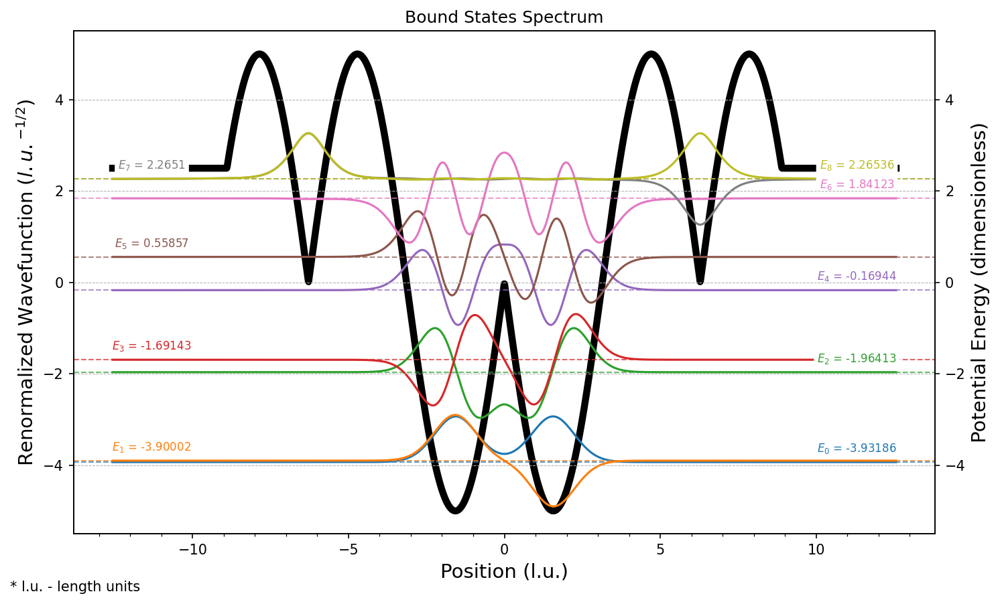

# QMSolver

**QMSolver** is a Python library for numerically solving the time-independent Schrödinger equation in one dimension. The library implements the finite difference method to compute energy eigenvalues and eigenfunctions for quantum mechanical systems with arbitrary potential energy functions.

## Installation

### PyPI Installation

```bash
pip install qmsolver
```
**Requirements:** Python >= 3.9

### Repo Installation

1. **Clone the repository:**
   ```bash
   git clone https://github.com/gbatagian/qmsolver.git
   cd qmsolver
   ```

2. **Create and enter the virtual environment:**
   * Install `pipenv` if not installed: `pip install pipenv`
   * Create and enter the virtual environment
        ```bash
        pipenv install --dev
        pipenv shell
        ```

3. **Install the source code:**
   ```bash
   pip install -e .
   ```

## Usage

### Finite Differences Solver (`FDSolver`)

The `qmsolver` package provides the `tise` module, which contains the `FDSolver` class for solving the time-independent Schrödinger equation using finite differences. To use it, create an `FDSolver` instance and inject a potential class into its `potential_generator` attribute. Sample potentials are provided in the `potentials` module. For example, the finite square well solution is demonstrated below:

```python
from qmsolver.tise import FDSolver
from qmsolver.potentials import FiniteSquareWellPotential

solver = FDSolver(steps=2_000, x_min=-5, x_max=5, n_lowest=7)
potential = FiniteSquareWellPotential(
    x_grid=solver.x_grid, well_depth=25, well_width=2
)
solver.potential_generator = potential
solver.solve()
solver.output()
solver.plot()
```

```bash
****************************************

-> 7 lowest energy states:

      E(0) = -24.055438366060855
      E(1) = -21.24089736975921
      E(2) = -16.62404645487225
      E(3) = -10.37013368913339
      E(4) = -2.999982564365393
      E(5) = 0.2854054853290151
      E(6) = 0.3280462337486476

****************************************
```

> **⚠️ Attention:** The `FiniteSquareWellPotential` class requires a spatial grid as input. It is recommended to provide the `x_grid` of the solver to ensure the potential and solver use the same grid.

This will generate a plot showing the potential (black line) and the first few energy eigenstates:


## Method Limitations

The finite difference method is well-suited for computing **bound states** of quantum systems, but has some limitations for **unbound states** (scattering or continuum states).

The numerical implementation imposes **zero boundary conditions** at the edges of the spatial grid (**x_min** and **x_max**). This effectively encloses the system within an **infinite square well** of width (x_max - x_min), which introduces artificial quantization of the continuum energy spectrum.

For bound states, the wave functions decay exponentially to zero outside the potential region. Since they naturally satisfy the zero boundary conditions at the grid edges, the computed energies and wave functions are largely unaffected by the grid size, provided the grid extends sufficiently far to capture the exponential tail.

For scattering states, the wave functions oscillate and do not decay to zero. The artificial boundary conditions at the grid edges cause **reflection** of the wave function, creating standing waves that depend on the grid length. This leads to:
  - **Quantization** of the continuum spectrum
  - **Grid-dependent** energy levels and wave functions

`FDSolver` is better-suited for bound state problems and provides reliable results within that domain - as long as the grid extends sufficiently beyond the potential region to minimize boundary effects. For scattering states, the numerical solutions behave as if the system is confined within an infinite potential well, with complete wave function reflection at the grid boundaries, leading to quantization of the continuum energy spectrum. 

## Custom Potential Implementation

While the `potentials` module provides several predefined potential classes, you can also implement custom potentials by inheriting from the `BasePotential` abstract base class. This allows you to solve the Schrödinger equation for arbitrary potential energy functions. To create a custom potential class:

1. **Inherit from `BasePotential`**: Your class must inherit from `potentials.base.BasePotential`
2. **Implement the `generate()` method**: This method should return a NumPy array containing the potential energy values evaluated on the spatial grid
3. **Accept grid as input**: The `__init__` method should accept the spatial grid (`x_grid`) as a parameter
4. **Instance attribute parameters**: Any potential parameters (depths, widths, etc.) should be stored as instance attributes

Below follows an example implementation of a sinusoidal potential well:

> **⚠️ Important:** All parameters required by the `generate()` method must be provided through the `__init__` method and stored as instance attributes (accessed through the `self` namespace). The `generate()` method should not accept additional parameters - it should only return the potential array using the stored parameters and the grid.

```python
import numpy as np

from qmsolver.potentials import BasePotential
from qmsolver.tise.finite_differences import FDSolver


class SinusoidalWellPotential(BasePotential):
    """
    A sinusoidal potential well: V(x) = -A * |sin(x)| for |x| ≤ π, 0 otherwise
    """

    def __init__(self, x_grid: np.array, amplitude: float) -> None:
        """
        Parameters:
        - x_grid: Spatial grid points
        - amplitude: Amplitude of the sinusoidal modulation (A > 0)
        """
        self.x_grid = x_grid
        self.amplitude = amplitude

    def generate(self) -> np.array:
        """
        Generate the potential energy array.

        Returns:
            np.array: Potential energy values on the grid
        """
        return np.where(
            np.abs(self.x_grid) <= np.pi,
            -self.amplitude * np.abs(np.sin(self.x_grid)),
            0.0,
        )


solver = FDSolver(steps=2000, x_min=-10, x_max=10, n_lowest=5)
potential = SinusoidalWellPotential(x_grid=solver.x_grid, amplitude=5.0)
solver.potential_generator = potential
solver.solve()
solver.output()
solver.plot()
```

```bash
****************************************

-> 5 lowest energy states:

      E(0) = -3.9325130490544944
      E(1) = -3.9007355756749442
      E(2) = -1.9743485404975893
      E(3) = -1.709360959487448
      E(4) = -0.2899193058335374

****************************************
```



# Development

## Quick start

1. Build the package: `make build`
2. Install in development mode: `make install-dev`
3. Run the test suite: `make test`

## Full Development Setup

1. **Python >= 3.9** should be installed
2. **Pipenv** should be installed (if not: `pip install pipenv`)
3. Create the virtual environment: `make venv`
4. Run the test suite: `make test`

## Additional Development Commands

- **Format code**: `make reformat` (runs black and isort)
- **Run tests with coverage**: `make coverage`
- **Create the virtual environment**: `make venv`